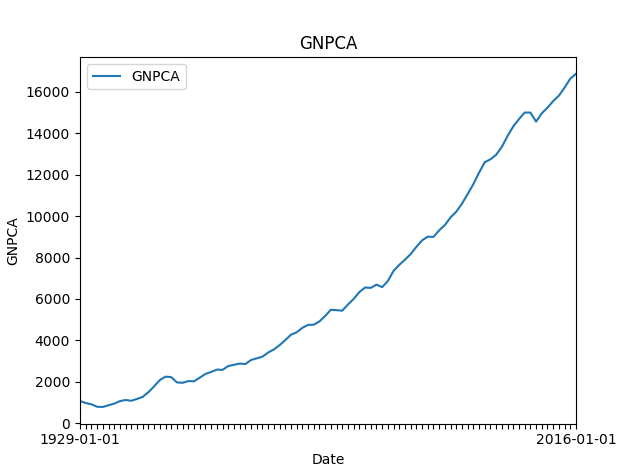
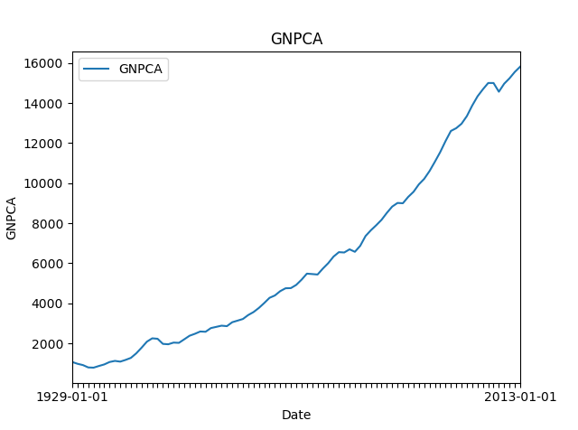
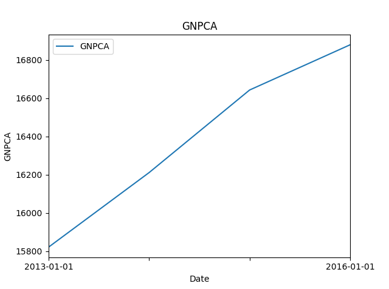

# FRED-API (Read-me and in file documentation in progress)

## Description <a name="Description"></a>
This API contains functions to retrieve economic time-series from the Federal Reserve Economic Data API and store the data using SQL database.

## Table of Contents
1. [Description](#Description)
2. [Database Layout](#Database)
3. [Usage](#Usage)
4. [Future Development](#FutureDevelopment)
5. [Files](#Files)
6. [License](#License)

## Database Layout<a name="Database"></a>
Every unique time-series has its own table. We have one table called **Series_info** containing summary of all time-series.

Schema of **Series_info**: 

(series_id String,n Integer,n_missing Integer,start_date String,end_date String,r_start_date String,r_end_date String,graph_file String, Primary Key (series_id))

Schema of the table corresponding to a time-series (series_id is the ID of the series in the FRED): 

( "date" TIMESTAMP, "realtime_end" TEXT, "realtime_start" TEXT, "series_id" REAL )

## Usage<a name="Usage"></a>
Everyone has his/her own API key. Here we use "ABC" as the key.
### Retrieve a new time-series from FRED
```Python
from get_obs_json import get_obs_json
from fetch_FRED_data import fetch_FRED_data

API_KEY = "ABC"
fetch_FRED_data(db_file_name = 'time_series.sqlite', series_id="GNPCA", api_key=API_KEY)
```
Output:

```Python
Table Series_info set-up success!

Name of Series         : GNPCA
Number of Obs          : 88
Number of Missing Obs  : 0
Start Date             : 1929-01-01
End   Date             : 2016-01-01
Realtime End   Date    : 2017-10-10

0 observations removed for analysis and graphing

Mean                   : 6584.64204545
Variance               : 24395833.9558
Maximum                : 16879.0
Minimum                : 784.0
GNPCA  created
Series_info updated
```
<div id="bg">
  
</div>  

### Update an existing time-series 
```Python
from get_obs_json import get_obs_json
from fetch_FRED_data import fetch_FRED_data

API_KEY = "ABC"

r = get_obs_json(API_KEY,"GNPCA",observation_end = "2013-01-01")
import sqlite3
conn = sqlite3.connect('time_serie555.sqlite')
cur = conn.cursor()
r.df.to_sql("GNPCA",conn)
conn.commit()
conn.close()

fetch_FRED_data(db_file_name = 'time_series555.sqlite', series_id="GNPCA", api_key = API_KEY)
```

Output:
```Python
Name of Series         : GNPCA
Number of Obs          : 85
Number of Missing Obs  : 0
Start Date             : 1929-01-01
End   Date             : 2013-01-01
Realtime End   Date    : 2017-10-10

0 observations removed for analysis and graphing

Mean                   : 6231.94352941
Variance               : 21571989.6699
Maximum                : 15822.2
Minimum                : 784.0
Table Series_info set-up success!
SELECT * FROM GNPCA ORDER BY date DESC LIMIT 1
Name of Series         : GNPCA
Number of Obs          : 88
Number of Missing Obs  : 0
Start Date             : 1929-01-01
End   Date             : 2016-01-01
Realtime End   Date    : 2017-10-10

0 observations removed for analysis and graphing

Mean                   : 6584.64204545
Variance               : 24395833.9558
Maximum                : 16879.0
Minimum                : 784.0
GNPCA  created
Series_info updated
```
<div id="bg">
  
</div>
<div id="bg">
  
</div>